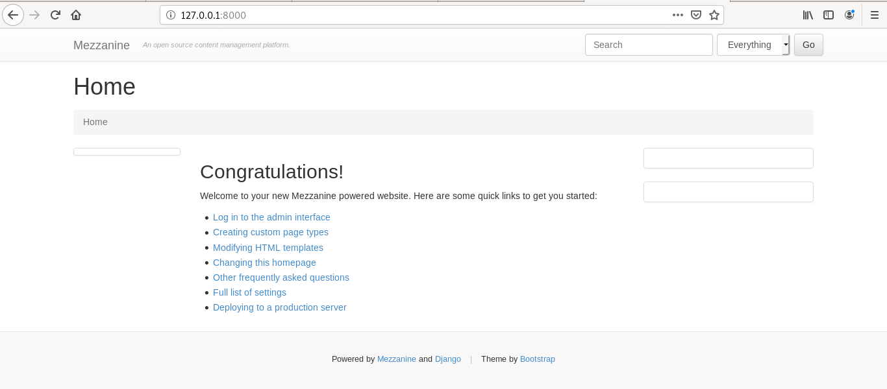
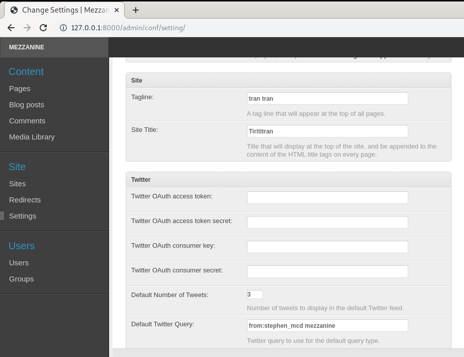
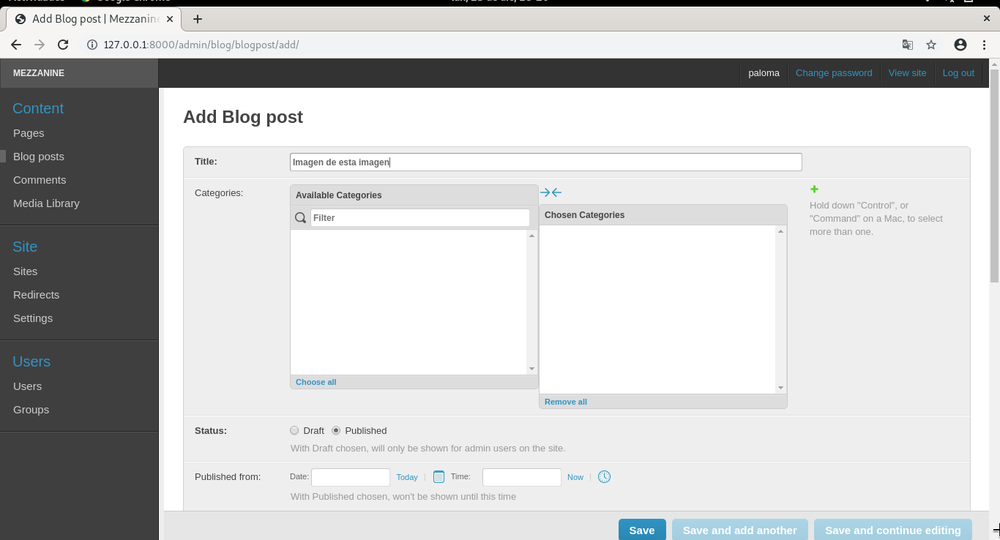
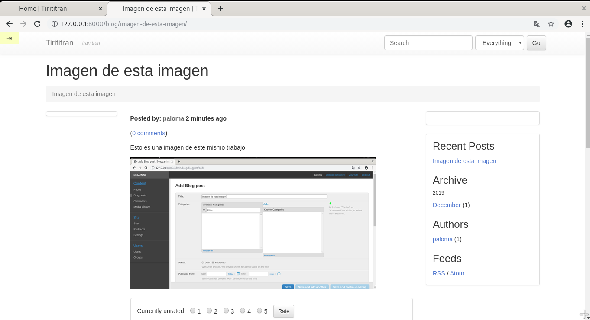
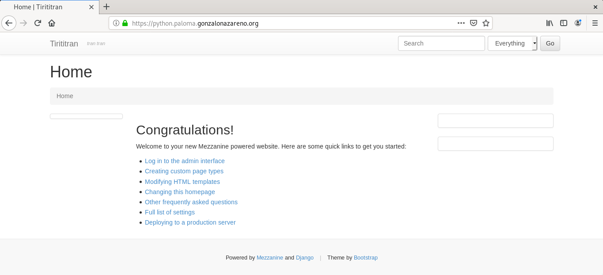

# Instalación de aplicación python

En esta tarea vamos a desplegar un CMS python. Hemos elegido Mezzanine, pero puedes elegir otro CMS python basado en django.

## Instala el CMS en el entorno de desarrollo. Debes utilizar un entorno virtual.

### Creación del entorno virutal
Se crea un entorno virtual:
~~~
paloma@coatlicue:~/DISCO2/CICLO II$ python3 -m venv mezzanine
paloma@coatlicue:~/DISCO2/CICLO II$ source mezzanine/bin/activate
(mezzanine) paloma@coatlicue:~/DISCO2/CICLO II$  
~~~

A continuación se instala mezzanine:
~~~
(mezzanine) paloma@coatlicue:~/DISCO2/CICLO II/mezzanine$ pip install mezzanine
~~~

Se crea el fichero requetiments que contrendrá los paquetes:
~~~
(mezzanine) paloma@coatlicue:~/DISCO2/CICLO II/mezzanine$ pip freeze > requirements.txt
~~~

> Quizás antes hay que actualizar pip:
~~~
(mezzanine) paloma@coatlicue:~/DISCO2/CICLO II/mezzanine$ pip install --upgrade pip
~~~

De esta forma, el contenido de requeriment.txt es:
~~~
(mezzanine) paloma@coatlicue:~/DISCO2/CICLO II/mezzanine$ cat requirements.txt 
beautifulsoup4==4.8.2
bleach==3.1.0
certifi==2019.11.28
chardet==3.0.4
Django==1.11.27
django-contrib-comments==1.9.2
filebrowser-safe==0.5.0
future==0.18.2
grappelli-safe==0.5.2
idna==2.8
Mezzanine==4.3.1
oauthlib==3.1.0
Pillow==6.2.1
pytz==2019.3
requests==2.22.0
requests-oauthlib==1.3.0
six==1.13.0
soupsieve==1.9.5
tzlocal==2.0.0
urllib3==1.25.7
webencodings==0.5.1
~~~

> Es posible que en requeriment.txt aparezca la línea "pkg-resources==0.0.0" en cuyo caso hay que eliminarla para evitar conflictos.

### Proyecto mezzanine
Para crear el proyecto:
~~~
(mezzanine) paloma@coatlicue:~/DISCO2/CICLO II/mezzanine$ mezzanine-project python_iaw
~~~

Y la base de datos:
~~~
(mezzanine) paloma@coatlicue:~/DISCO2/CICLO II/mezzanine$ python3 python_iaw/manage.py migrate
~~~

Se crear el superuser:
~~~
(mezzanine) paloma@coatlicue:~/DISCO2/CICLO II/mezzanine$ python3 python_iaw/manage.py createsuperuser
Username (leave blank to use 'paloma'): 
Email address: palomagarciacampon08@gmail.com
Password: 
Password (again): 
Superuser created successfully.
~~~

Y se abre el servidor:
~~~
(mezzanine) paloma@coatlicue:~/DISCO2/CICLO II/mezzanine$ python3 python_iaw/manage.py runserver
              .....
          _d^^^^^^^^^b_
       .d''           ``b.
     .p'                `q.
    .d'                   `b.
   .d'                     `b.   * Mezzanine 4.3.1
   ::                       ::   * Django 1.11.27
  ::    M E Z Z A N I N E    ::  * Python 3.7.3
   ::                       ::   * SQLite 3.27.2
   `p.                     .q'   * Linux 4.19.0-6-amd64
    `p.                   .q'
     `b.                 .d'
       `q..          ..p'
          ^q........p^
              ''''

Performing system checks...

System check identified no issues (0 silenced).
December 27, 2019 - 20:08:05
Django version 1.11.27, using settings 'python_iaw.settings'
Starting development server at http://127.0.0.1:8000/
Quit the server with CONTROL-C.
~~~

## Personaliza la página (cambia el nombre al blog y pon tu nombre) y añade contenido (algún artículo con alguna imagen).

Desde la página de administrador se modifica el nombre de la página en el apartado settings.

Y se crea algún blog:

## Guarda los ficheros generados durante la instalación en un repositorio github. Guarda también en ese repositorio la copia de seguridad de la bese de datos.

Se realiza una copia de la base de datos en un fichero .json:
~~~
(mezzanine) paloma@coatlicue:~/DISCO2/CICLO II/mezzanine$ python3 python_iaw/manage.py dumpdata > python_iaw/CopiaBD.json
~~~

Y se sube todo a un repositorio de GitHub.
~~~
(mezzanine) paloma@coatlicue:~/DISCO2/CICLO II/mezzanine/python_iaw$ git init
(mezzanine) paloma@coatlicue:~/DISCO2/CICLO II/mezzanine/python_iaw$ git add -f *
(mezzanine) paloma@coatlicue:~/DISCO2/CICLO II/mezzanine/python_iaw$ git commit -m "Subir fichero aplicaciones cms python"
(mezzanine) paloma@coatlicue:~/DISCO2/CICLO II/mezzanine/python_iaw$ git remote add origin git@github.com:PalomaR88/python_iaw.git
(mezzanine) paloma@coatlicue:~/DISCO2/CICLO II/mezzanine/python_iaw$ git push -u origin master
~~~

## Realiza el despliegue de la aplicación en tu entorno de producción (servidor web y servidor de base de datos en el cloud). Utiliza un entorno virtual. Como servidor de aplicación puedes usar gunicorn o uwsgi (crea una unidad systemd para gestionar este servicio). La aplicación será accesible en la url python.tunombre.gonzalonazareno.org.

Ahora se trabaja sobre el entorno de desarrollo. Se clona el repositorio de gitHub desde el documentRoot de la máquina salmorejo.
~~~
[centos@salmorejo ~]$ cd /usr/share/nginx/html/
[centos@salmorejo html]$ sudo git clone https://github.com/PalomaR88/python_iaw.git
~~~

**Gunicorn** es un servidor de aplicaciones WSGI para python. Para ello hay que instalar los paquetes de Centos **python36** y **python36-devel**.
~~~
[centos@salmorejo python_iaw]$ sudo dnf install python36 python36-devel
~~~

### Creación del nuevo entorno y migraciones
Se crea el entorno virtual:
~~~
[root@salmorejo python_iaw]# python3 -m venv entVirtPython
[root@salmorejo python_iaw]# source entVirtPython/bin/activate
(entVirtPython) [root@salmorejo python_iaw]# 
~~~

Y se instalan los paquetes y librerias que se copiaron en el **requiments.txt**:
~~~
(entVirtPython) [root@salmorejo python_iaw]# pip install -r requirements.txt
~~~

Se crea la base de datos y el usuario:
~~~
MariaDB [(none)]> create database pythoncms;
Query OK, 1 row affected (0.05 sec)

MariaDB [(none)]> create user python identified by 'python';
Query OK, 0 rows affected (0.08 sec)

MariaDB [(none)]> grant all privileges on pythoncms.* to python;
Query OK, 0 rows affected (0.00 sec)

MariaDB [(none)]> flush privileges;
Query OK, 0 rows affected (0.04 sec)
~~~

A continuación, se modifica el fichero **/python_iaw/settings.py** para indicar la nueva base de datos que se va a utilizar:
~~~
DATABASES = {
    "default": {
        # Add "postgresql_psycopg2", "mysql", "sqlite3" or "oracle".
        "ENGINE": "mysql.connector.django",
        # DB name or path to database file if using sqlite3.
        "NAME": "pythoncms",
        # Not used with sqlite3.
        "USER": "python",
        # Not used with sqlite3.
        "PASSWORD": "python",
        # Set to empty string for localhost. Not used with sqlite3.
        "HOST": "tortilla.paloma.gonzalonazareno.org",
        # Set to empty string for default. Not used with sqlite3.
        "PORT": "",
    }
}
~~~

Además, se modifica, en este mismo fichero, el 'Allowed_hosts':
~~~
ALLOWED_HOSTS = ['python.paloma.gonzalonazareno.org']
~~~

Se instala el conector de MYSQL para python:
~~~
(entVirtPython) [root@salmorejo python_iaw]# pip install mysql-connector-python
~~~

> Se recomienda eliminar el fichero **dev.db** para evitar conflictos con la nueva base de datos:
~~~
(entVirtPython) [root@salmorejo python_iaw]# rm dev.db 
rm: ¿borrar el fichero regular 'dev.db'? (s/n) s
~~~

También se elimina el fichero **python_iaw/local_settings.py** para que la información se lea del fichero **python_iaw/setting.py**.Pero antes de hacer es muy importante que se copie las variables **SECRET_KEY** y **NEVERCACHE_KEY** en el nuevo setting.org si no estaban:
~~~
SECRET_KEY = "!-9qv8xk1p!om7s7s6ojet!4n16b@(p3@$#g%)w#_t&%zfr@!!"
NEVERCACHE_KEY = "gyxsra29iv20e^mi0hs@oy^z@4=ne1tqa4hk)n!gqv6i2iz&%g"
~~~

~~~
(entVirtPython) [root@salmorejo python_iaw]# rm local_settings.py 
rm: ¿borrar el fichero regular 'local_settings.py'? (s/n) s
~~~

Se realiza la migración a la base de datos MySQL:
~~~
(entVirtPython) [root@salmorejo python_iaw]# python3 manage.py migrate
Operations to perform:
  Apply all migrations: admin, auth, blog, conf, contenttypes, core, django_comments, forms, galleries, generic, pages, redirects, sessions, sites, twitter
Running migrations:
  Applying contenttypes.0001_initial... OK
  Applying auth.0001_initial... OK
  Applying admin.0001_initial... OK
  Applying admin.0002_logentry_remove_auto_add... OK
  Applying contenttypes.0002_remove_content_type_name... OK
  Applying auth.0002_alter_permission_name_max_length... OK
  Applying auth.0003_alter_user_email_max_length... OK
  Applying auth.0004_alter_user_username_opts... OK
  Applying auth.0005_alter_user_last_login_null... OK
  Applying auth.0006_require_contenttypes_0002... OK
  Applying auth.0007_alter_validators_add_error_messages... OK
  Applying auth.0008_alter_user_username_max_length... OK
  Applying sites.0001_initial... OK
  Applying blog.0001_initial... OK
  Applying blog.0002_auto_20150527_1555... OK
  Applying blog.0003_auto_20170411_0504... OK
  Applying conf.0001_initial... OK
  Applying core.0001_initial... OK
  Applying core.0002_auto_20150414_2140... OK
  Applying django_comments.0001_initial... OK
  Applying django_comments.0002_update_user_email_field_length... OK
  Applying django_comments.0003_add_submit_date_index... OK
  Applying pages.0001_initial... OK
  Applying forms.0001_initial... OK
  Applying forms.0002_auto_20141227_0224... OK
  Applying forms.0003_emailfield... OK
  Applying forms.0004_auto_20150517_0510... OK
  Applying forms.0005_auto_20151026_1600... OK
  Applying forms.0006_auto_20170425_2225... OK
  Applying galleries.0001_initial... OK
  Applying galleries.0002_auto_20141227_0224... OK
  Applying generic.0001_initial... OK
  Applying generic.0002_auto_20141227_0224... OK
  Applying generic.0003_auto_20170411_0504... OK
  Applying pages.0002_auto_20141227_0224... OK
  Applying pages.0003_auto_20150527_1555... OK
  Applying pages.0004_auto_20170411_0504... OK
  Applying redirects.0001_initial... OK
  Applying sessions.0001_initial... OK
  Applying sites.0002_alter_domain_unique... OK
  Applying twitter.0001_initial... OK
~~~

> Durante la migración de la base de datos puede surgir el siguinete error:
~~~
django.db.utils.ProgrammingError: Specified key was too long; max key length is 767 bytes
~~~

Si es así, hay que modificar algunos parámetros de la siguiente manera:
~~~ 
MariaDB [(none)]> use pythoncms
Database changed
MariaDB [pythoncms]> SET @@global.innodb_large_prefix = 1;
Query OK, 0 rows affected (0.00 sec)

MariaDB [pythoncms]> set global innodb_default_row_format = DYNAMIC;
Query OK, 0 rows affected (0.00 sec)
~~~

Por último, se cargan los datos en la base de datos que se alojaron en el fichero **CopiaBD.json**:
~~~
(entVirtPython) [root@salmorejo python_iaw]# python3 manage.py loaddata CopiaBD.json 
Installed 151 object(s) from 1 fixture(s)
~~~

### Instalación de configuración de gunicorn
Se instala **gunicorn**:
~~~
(entVirtPython) [root@salmorejo python_iaw]# pip install gunicorn
~~~

Se crea el fichero **/etc/systemd/system/gunicorn.socket** que será el socket de gunicorn con la siguiente configuración:
~~~
[Unit]
Description=gunicorn socket

[Socket]
ListenStream=/run/gunicorn.sock

[Install]
WantedBy=sockets.target
~~~

Y se crea la unidad de systemd en **/etc/systemd/system/gunicorn.service** indicando la ubicación del script de mezzanine:
~~~
[Unit]
Description=gunicorn daemon
After=network.target

[Service]
WorkingDirectory=/usr/share/nginx/html/python_iaw
ExecStart=/bin/bash /usr/share/nginx/html/python_iaw/mezzanine.sh
ExecReload=/bin/bash /usr/share/nginx/html/python_iaw/mezzanine.sh
RemainAfterExit=yes

[Install]
WantedBy=multi-user.target
~~~

Por último, se crea, en la ubicación donde se ha especificado anterioremnte, el script con la siguiente configuración:
~~~
#!/bin/bash

NAME="python_iaw"
DJANGODIR=/usr/share/nginx/html/python_iaw
USER=nginx
GROUP=nginx
WORKERS=3
BIND=unix:/run/gunicorn.sock
DJANGO_SETTINGS_MODULE=python_iaw.settings
DJANGO_WSGI_MODULE=python_iaw.wsgi
LOGLEVEL=error

cd $DJANGODIR
source /usr/share/nginx/html/python_iaw/entVirtPython/bin/activate

export DJANGO_SETTINGS_MODULE=$DJANGO_SETTINGS_MODULE
export PYTHONPATH=$DJANGODIR:$PYTHONPATH

exec /usr/share/nginx/html/python_iaw/entVirtPython/bin/gunicorn ${DJANGO_WSGI_MODULE}:application \
  --name $NAME \
  --workers $WORKERS \
  --user=$USER \
  --group=$GROUP \
  --bind=$BIND \
  --log-level=$LOGLEVEL \
  --log-file=-
~~~

### Creación del virtualhost
La configuración del vitualHost, que será un fichero llamado **/etc/nginx/conf.d/mezzanine.conf** es:
~~~
server {
        listen 80;
        server_name python.paloma.gonzalonazareno.org;
        return 301 https://$server_name$request_uri;
}

server {
    listen 443 ssl;
    ssl on;
    ssl_certificate /etc/pki/tls/certs/paloma.gonzalonazareno.org.crt;
    ssl_certificate_key /etc/pki/tls/private/gonzalonazareno.pem;
    server_name python.paloma.gonzalonazareno.org;
    root  /usr/share/nginx/html/python_iaw;
    location / {
      proxy_set_header X-Forwarded-For $proxy_add_x_forwarded_for;
      proxy_set_header X-Forwarded-Proto $scheme;
      proxy_set_header Host $http_host;
      # we don't want nginx trying to do something clever with
      # redirects, we set the Host: header above already.
      proxy_redirect off;
      proxy_pass http://unix:/run/gunicorn.sock;
    }
    location /static {
        alias  /usr/share/nginx/html/python_iaw/static;
    }
}
~~~

Se cambian los permisos del documentRoot:
~~~
(entVirtPython) [root@salmorejo python_iaw]# chown -R nginx:nginx /usr/share/nginx/html/python_iaw
~~~

Y se crean los enlacecs simbólicos de todos los static:
~~~
(entVirtPython) [root@salmorejo python_iaw]# python3 manage.py collectstatic
~~~
 
### Reglas de SELinux
~~~
[centos@salmorejo python_iaw]$ sudo setsebool -P httpd_can_network_connect on
[centos@salmorejo python_iaw]$ sudo find /usr/share/nginx/html/python_iaw -type f -exec chmod 0644 {} \;
[centos@salmorejo python_iaw]$ sudo find /usr/share/nginx/html/python_iaw -type d -exec chmod 0755 {} \;
[centos@salmorejo python_iaw]$ sudo chcon -t httpd_sys_rw_content_t /usr/share/nginx/html/python_iaw -R
[centos@salmorejo python_iaw]$ sudo chcon -t httpd_sys_content_t /usr/share/nginx/html/python_iaw -R
~~~

### DNS
En la máquina servidora de DNS se agerga una nueva línea:
~~~
python          IN  CNAME   salmorejo
~~~

## Reiniciar gunicorn
[centos@salmorejo ~]$ sudo systemctl restart gunicorn.socket
[centos@salmorejo ~]$ sudo systemctl restart gunicorn

### Comprobación

